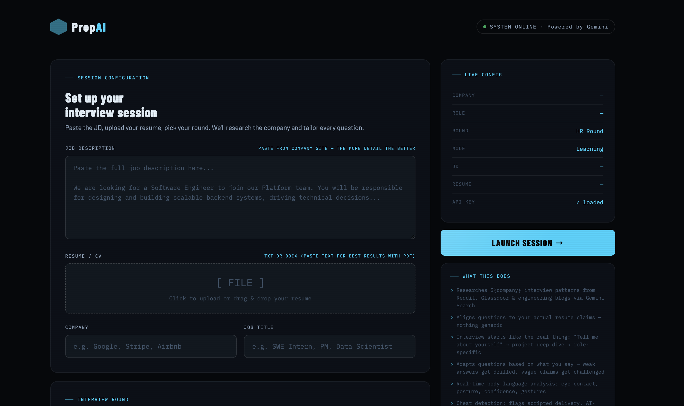
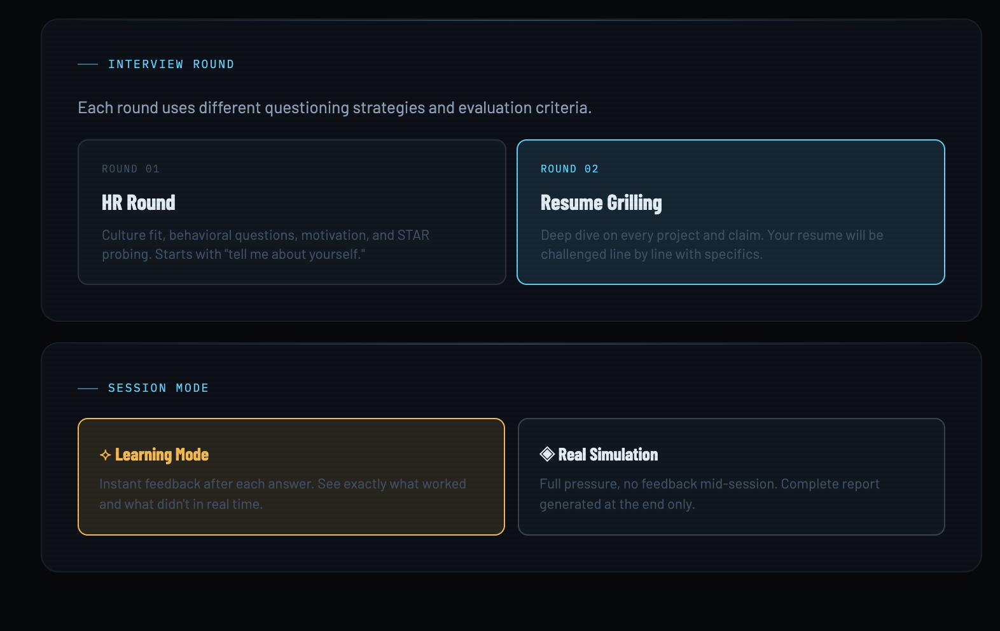
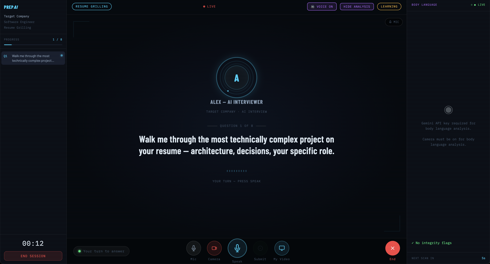

# fake-it-till-you-make-it 🎭
### PrepAI — The AI Interview Coach That Doesn't Go Easy On You

> Upload your resume. Get grilled. Get better.

Built at the **Google NYC Hackathon 2026** by **Union Squared**.

---

## 🎬 Demo

| Setup | Round Selection | Live Interview |
|---|---|---|
|  |  |  |

**Live:** https://storage.googleapis.com/interview-coach-uploads-legaxdcr3xftc/v4/index.html

---

## What is PrepAI?

PrepAI is a multimodal AI interview simulator powered by Google Gemini. It goes way beyond a chatbot — it watches you, listens to you, and grills you like a real interviewer would.

You paste your JD, upload your resume, pick your round, and Alex (your AI interviewer) takes over. Questions are tailored to your actual resume claims. Vague answers get challenged. Weak stories get drilled with follow-ups. And at the end, you get ruthless, actionable feedback.

---

## Features

**Three Interview Rounds**
- **HR Round** — Culture fit, behavioral questions, STAR probing. Starts with "tell me about yourself."
- **Resume Grilling** — Every project and claim on your resume gets challenged line by line.
- **Live Coding** — Technical problem solving with explanation and trade-off analysis.

**Two Modes**
- **Learning Mode** — Instant feedback after each answer. See exactly what worked and what didn't in real time.
- **Real Simulation** — Full pressure, no feedback mid-session. Complete report generated at the end only.

**Four Feedback Dimensions**
- 🎯 **Vibe & Confidence** — Pacing, filler words, clarity, body language
- 📄 **Resume Coherence** — Do you actually know what you put on your resume?
- 🧠 **Behavioral Fit** — STAR format, story consistency, 7-step grilling to detect BS
- ⚙️ **Technical Depth** — Accuracy, trade-offs, complexity under pressure

**Integrity Detection**
- Eye contact tracking via webcam
- Tab switch detection
- Copy-paste flagging
- Integrity report included in final feedback

---

## Tech Stack

| Layer | Technology |
|---|---|
| Frontend | Vanilla HTML/CSS/JS |
| AI | Google Gemini 1.5 Pro via Gemini API |
| Voice | Web Speech API + Gemini multimodal |
| Body Language | Gemini Vision (webcam frames) |
| Backend | FastAPI on Google Cloud Run |
| Database | Google Firestore |
| Storage | Google Cloud Storage |
| Deployment | Google Cloud Run + Cloud Storage |

---

## Team

**Union Squared** — Google NYC Hackathon 2026

Team
| Kavya Sri Yakkala |
| Narayani Sai Pemmaraju | 
| Sanjana Mohan |
---

## Run Locally

### Prerequisites
- A Gemini API key — get one free at [aistudio.google.com](https://aistudio.google.com)
- Python 3.11+ (for backend)
- A modern browser with microphone + camera access

### Frontend (no install needed)

```bash
git clone https://github.com/npemmaraju/fake-it-till-you-make-it.git
cd fake-it-till-you-make-it/prepai
python3 -m http.server 3000
```

Open `http://localhost:3000` in your browser.

Enter your Gemini API key in the setup screen and you're ready to go.

### Backend (optional — for resume parsing + Firestore session storage)

```bash
cd fake-it-till-you-make-it/backend
python3 -m venv venv
source venv/bin/activate  # Windows: venv\Scripts\activate
pip install -r requirements.txt
```

Create a `.env` file in the `backend/` folder:
```env
GOOGLE_CLOUD_PROJECT=your-project-id
GEMINI_API_KEY=your-gemini-api-key
GCS_BUCKET=your-bucket-name
FIRESTORE_DATABASE=(default)
GOOGLE_CLOUD_REGION=us-central1
```

Then run:
```bash
uvicorn main:app --reload --port 8080
```

Backend API docs available at `http://localhost:8080/docs`.

---

## Deploy to Google Cloud

### Frontend
```bash
gcloud storage cp -r prepai/* gs://YOUR_BUCKET/
gsutil -m acl ch -r -u AllUsers:R gs://YOUR_BUCKET/
```

### Backend
```bash
cd backend
gcloud run deploy prepai-backend \
  --source . \
  --region us-central1 \
  --allow-unauthenticated \
  --set-env-vars "GEMINI_API_KEY=your-key,GOOGLE_CLOUD_PROJECT=your-project"
```

---

## Architecture

```
Browser (prepai/index.html)
    │
    ├── Gemini API (direct) ──── Question generation, follow-ups, feedback
    ├── Web Speech API ────────── Voice input/output  
    └── Webcam ────────────────── Body language + integrity detection
    
    │ (optional backend calls)
    ▼
FastAPI (Cloud Run)
    ├── /upload ─────── Resume PDF → Cloud Storage → text extraction
    ├── /session ─────── Session state → Firestore
    └── /feedback ────── Final report generation
```

---

## License

MIT
